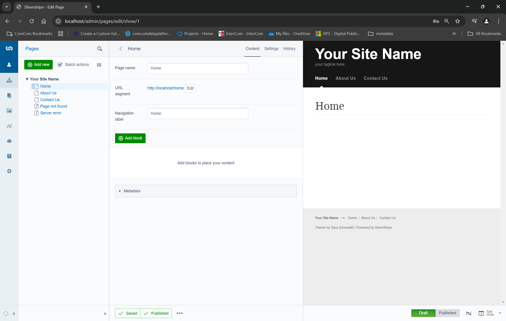

# Local Silverstripe Development

This repository contains enough to bootstrap a local develop environment for developing a website using the Silverstripe CMS.  Silverstripe is a PHP application, and requires a web server and a backend database.  The typical setup uses Apache HTTP Server and MySQL.  The setup here uses Docker.  NGINX is used as the webserver, and MariaDB as the database.


## Quick start

A minimal test project is included in `projects/test`.  For illustrative purposes, it can be started by running:

```bash
bash setup-test.sh
docker compose -f docker-compose-test.yml up -d
```

The first run will likely take a while since the required Docker images will need to be built first.  Once up and running, simply visit `http://localhost/admin`.  Login using username `admin`, and password `password`.




## Setup

It is assumed the reader has a working Docker installation, including Docker Compose.  Images can be built ahead of time by running:

```bash
bash setup.sh
# or ./setup.sh if executable
```


## Create a Silverstripe project (website)

To create a new project / website, first ensure we have a folder called `projects` inside of which we will house all our projects:

```bash
mkdir projects
```

Then, to create a new project called `my-website`:

```bash
docker run -it --rm \
  --user $(id -u):$(id -g) \
  -v ${PWD}/projects:/work \
  composer create-project silverstripe/installer my-website
```

This will create a folder called `projects/my-website`, inside of which should be a working, albeit minimal, Silverstripe website. 


## Adding modules to a project

We will almost certainly want to add additional modules.  In particular, most non-trivial websites will probably use [Silverstripe Elemental](https://github.com/silverstripe/silverstripe-elemental).  To add this:

```bash
docker run -it --rm \
  --user 1000:1000 \
  -v ${PWD}/projects/my-website:/work \
  composer require dnadesign/silverstripe-elemental
```

For elemental to work, we create a file called `projects/test/app/_config/elements.yml` with the following content:

```yml
Page:
  extensions:
    - DNADesign\Elemental\Extensions\ElementalPageExtension
```

We must also replace `$Content` with `$ElementalArea` in all templates (located somewhere under `./projects/my-website/themes/<theme>/templates/`).

## Run a project

A project can be run with a web server and supporting database using Docker Compose.  Simply run:

```bash
docker compose up -d
```

The website can then be visited at `http://localhost`.  The admin page is accessed at `http://localhost/admin`--the username and password will be as passed to the running container as environment variables `SS_DEFAULT_ADMIN_USERNAME` and `SS_DEFAULT_ADMIN_PASSWORD`, respectively (see below).  

Note that the back-end database will be empty on first run.  In this case, the database will be automatically built by redirecting to `/dev/build`.  Note that one can also do this build manually.  First, access the running container in a terminal by issuing:

```bash
docker compose exec -it silverstripe /bin/bash
```

and then initialise the database by running:

```bash
/opt/nginx/html/vendor/bin/sake db:build
```

The `/dev/build` endpoint can also be triggered by running:

```bash
/opt/nginx/html/vendor/bin/sake /dev/build
```

Note that the setup will expect a number of environment variables to be set.  This is most easily done by including all required variables in a file called `.env`.  An example file called `.env.example` is included with the following content:

```bash
SS_TRUSTED_PROXY_IPS=*
SS_ENVIRONMENT_TYPE=dev
SS_DATABASE_SERVER=database
SS_DATABASE_NAME=silverstripe
SS_DATABASE_USERNAME=admin
SS_DATABASE_PASSWORD=password
SS_DEFAULT_ADMIN_USERNAME=admin
SS_DEFAULT_ADMIN_PASSWORD=password
MARIADB_ROOT_PASSWORD=password
```

In addition to this, the provided compose file will need access to an environment variable called `SS_PROJECT_DIR` (defaults to `./projects/test`) in order to mount the correct project.  This can be exported in the usual way before running `docker compose`, or else passed as follows:

```bash
SS_PROJECT_DIR=${PWD}/projects/my-website docker compose -f <compose file>.yml up -d
```

Note that the permissions are a bit fiddly.  The setup has been provided to run as a root user for now (starting the required services as a normal user is awkward), but this causes issues when trying to write or modify files in the Silverstripe project folder via the Silverstripe web UI.  For now, the Silverstripe folder will be recursively assigned a group of `www-data` on startup, and `go+rwx` permissions are applied.  

Note that the same `.env` file, but wihtout the `MARIADB_ROOT_PASSWORD` entry,  will also need to be included in a `.env` file in the Silverstripe project website directory. A test project is included in `projects/test` which includes a `.env` file which matches `.env.example` in the repository root.  Users will need to ensure dependencies are restored from `composer.lock` by first running:

```bash
docker run -it --rm \
  --user 1000:1000 \
  -v ${PWD}/projects/my-website:/work \
  composer install
```